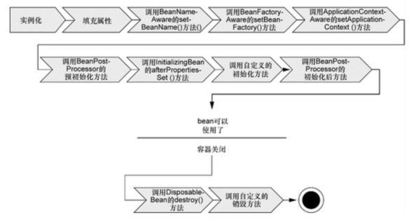
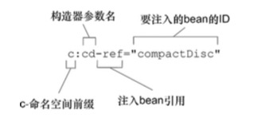
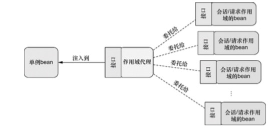
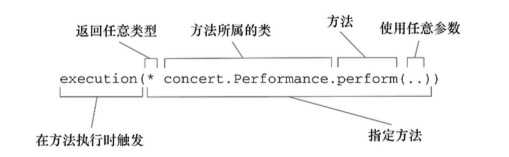
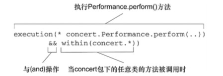
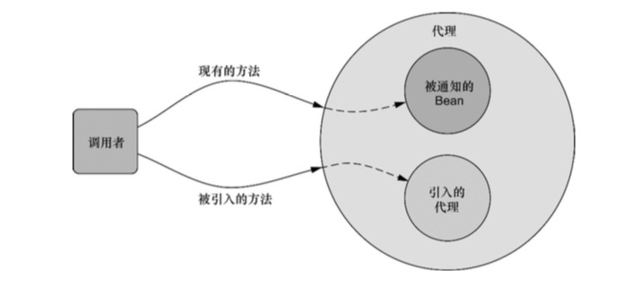

# Spring实战
## 第一章 Spring的核心
### 核心
- 依赖注入（DI）
- 面向切面编程（AOP）

- Spring的bean容器
- 介绍Spring的核心模块
- 更为强大的Spring生态系统
- Spring的新功能
#### Spring 采取的关键策略 
- 基于POJO的轻量级和最小侵入性编程
- 通过依赖注入和面向接口实现松耦合
- 基于切面和惯例进行声明式编程
- 通过切面和末班减少样板式代码

#### 激发POJO 的潜能
很多管家通过应用继承他们的类或实现他们的接口来导致了和框架绑死，这个叫做侵入式编程
- Spring 的有点，Spring不会强迫你实现Spring 的接口或者继承Spring 规范的类

#### 依赖注入
- 背景：
类相互之间进行写作来完成特定的业务逻辑，按照传统做法，每个对象负责管理与自己协作的对象的引用即类需要创建自己依赖的对象，这会导致高度耦合和难以测试的代码。
```Java
package com.springinaction.knights;

public class DamselRescuingKinght implements Knight{
	private RescueDamselQuest quest;

	public DamselRescuingKinght(){
		this.quest = new RescueDamselQuest();
	}

	public void embarkOnQuest(){
		quest.embark();
	}
}
```
这个类在构造函数中创建了依赖的对象，两个对象耦合在了一起

#### 耦合：
- 反面：紧密耦合的代码那一测试、难以复用、难以理解，一个bug修复可能会造成其他bug
- 正面：没有耦合的代码什么也做不了。

### DI
通过DI,对象的依赖关系将由系统中负责协调个对象的第三方组件在创建对象的时候进行设定。对象无需创建或管理他们的依赖关系

```Java
package com.springinaction.knights;

public class BraveKnight implements Knight{
	private Quest quest;

	public BraveKnight(Quest quest){
		this.quest = quest;
	}

	public void embarkOnQuest(){
		quest.embark();
	}
}
```
这里的Quest 没有自行创建，而是通过依赖注入，这是注入的一种方式 构造器注入
这里的要点是BraveKnight没有任何特定的Quest实现发生耦合。

```Java
package com.springinaction.knights;
import static org.mockito.Mockit.*;
import org.junit.Test;

public class BraveKnightTest{
	
	@Test
	public void kightShouldEmbarkOnQuest(){
		Quest mockQuest = mock(Quest.class);
		BraveKnight kight = new BraveKnight(mockQuest);
		knights.embarkOnQuest();
		verify(mockQuest,times(1))).embark();
	}
}
```

如何实现注入
将SlayDragonQuest注入到BraveKnight中
```Java

package com.springinaction.knights;

import java.io.PrintStream;

public class SlayDragonQuest implements Quest{
	private PrintStream stream;

	public SlayDragonQuest(PrintStream stream){
		this.stream = stream;
	}

	public void embark(){
		stream.println("Embarking on quest to slay the dragon");
	}
}
```

```xml
<?xml version="1.0" encoding="UTF-8"?>
<beans xmlns="http://www.springframework.org/schema/beans"
	xmlns:xsi="http://www.w3.org/2001/XMLSchema-instance"
	xsi:schemaLocation="http://www.springframework.org/schema/beans
		http://www.springframework.org/schema/beans/spring-beans.xsd">
		<bean id="knight" class="com.springframework.knights.BraveKnight">
			<constructor-arg ref="quest"/>
		</bean>

		<bean id="quest" class="com.springframework.knights.BraveKnight">
			<constructor-arg ref="#(T(System).out)"/>
		</bean>
```

```Java
package com.springframework.knights.config;

import org.springframework.context.annotation.Bean;
import org.springframework.context.annotation.Configuration;

import com.springinaction.knights.BraveKnight;
import com.springinaction.knights.Knight;
import com.springinaction.knights.Quest;
import com.springinaction.knights.SlayDragonQuest;

@Configuration
public class KnightConfig{
	
	@Bean
	public Knight knight(){
		return new BraveKnight(quest());
	}

	@Bean
	public Quest quest(){
		return new SlayDragonQuest(System.out);
	}
}
```

#### 应用切面
面向切面编程允许你把遍布应用各处的功能分离出来形成可重用的组件
- 如果将这些关注点分散到多个组件中。这意味着如果你要改变这些关注点的逻辑，必须修改哥哥木块中的相关实现。即使你把这些关注点抽象为一个独立的模块，其他模块也只是调用它的方法，但是方法的调用还是会重复出翔在各个模块中。
- 组件会因为那些与滋生核心业务无关的代码而变得混乱，一个向地址簿增加地址条目的方法应该只关注如何添加地址，而不关心它是不是安全或者是否需要支持事务。
在这个系统中关注点（例如日志和安全）的调经常散布到系统的各个模块中，而这些管租点不是模块的核心业务。
AOP能够使这些服务模块化，并以声明的放肆将它们应用到它们需要影响的组件中去。所造成的结果就是这些组件会具有更高的内聚性并且更加关注自身的业务，我能全不需要了解涉及系统服务带来的复杂性。总之AOP能够确保POJO的简单性。

拿骑士的例子来说明，有一个吟游诗人来记录骑士的实际并进行传唱
```Java
package com.springinaction.knights;

import java.io.PrintStream;

public class Minstrel{

	private PrintStram stream;

	public Minstrel(PringtStream stream){
		this.stream = stream;
	}

	public void singBeforeQuesr(){
		stream.println("Fa la la, the knight is so brave!");
	}

	public void mingAfterQuest(){
		stream.println("Tee hee hee,the brave knight."+"did embark on a quest!");
	}
}
```

如果不使用AOP
```Java
package com.springinaction.knights;

public class BraveKnight implements Knight{
	private Quest quest;

	private Minstrel minstrel;

	public BraveKnight(Quest quest,Minstrel minstrel){
		this.quest = quest;
		this.minstrel = minstrel;
	}

	public void embarkOnQuest() throws QuestException{
		minstrel.singBeforeQuesr();
		quest.embark();
		minstrel.singBeforeQuesr();
	}
}
```
记录是吟游诗人的分内之事,不需要骑士去管理,通过AOP,可以声明吟游诗人必须歌颂骑士的探险实际,而骑士本身并不直接访问Minstrel的方法.
```xml
<?xml version="1.0" encoding="UTF-8"?>
<beans xlmns="http://www.springframework.org/schema/beans"
	xlmns:xsi="http://www.w3.org2001/XMLSchema-instance"
	xlmns:aop="http://www.springframework.org/schema/aop
		http://www.springframework.org/schema/aop/spring-aop-3.2.xsd
		http://www.springframework.org/schema/beans
		http://www.springframework.org/schema/beans/spring-beans.xsd">
	<bean id="knight" class="com.springinaction.knight.BraveKnight">
		<constructor-arg ref="quest"/>
	</bean>		

	<bean id="quest" class="com.springinaction.knight.Minstrel">
		<constructor-arg value="#(T(System).out)"/>
	</bean>

	<bean id="minstrel" class="com.springinaction.knight.Minstrel">
		<constructor-arg value="#T(System).out"/>
	</bean>

	<aop:config>
		<aop:aspect ref="minstrel">
			<aop:pointcut id="embark" expression="execution( * *.embarkOnQuest(..)) *"/>

			<aop:before pointcut-ref="embark" method="singBeforeQuest"/>

			<aop:after pointcut-ref="embark" method="singafterQuest"/>
		</aop:aspect>
	</aop:config>
</beans>
```
这里通过使用了Spring的aop配置命名空间把Minstrel bean 声明为一个切面.首先将Minstrel声明为一个bean,然后再<aop:aspect>元素中引用改bean.为了进一步定义切面声明在embarkOnQuest()方法执行前调用Minstrel的singBeforeQuest()方法.这种方式被称为前置通知.同时声明在embarkOnQuest()方法执行之后调用singAfter Quest()方法,这种方式称之为后置通知.

### 容纳你的bean
在基于Spring的应用中,你的应用对象生存在Spring 容器中.Spring 容器负责创建对象装配它们并管理它们的整个声明周期,从生存到死亡.

#### 应用上下文
Spring 自带了多种类型的应用上下文
- AnnotiontationConfigApplicationContext:从一个或多个基于JAVA中的配置类加载Spring应用上下文.
- AnnotiontationConfigWebApplicationContext:从一个或多个基于JAVA的配置类中加载Spring Web应用上下文.
- ClassPathXmlApplicationContext:从类路径下的一个或多个XML配置文件中加载上下文定义.
- XmlWebApplicationContext:从Web应用下的一个或多个XML配置文件中加载上下文定义.

一下代码展示如何加载一个FileSystemXmlApplicationContext:
```Java
ApplicationContext context = new
	FileSystemXmlApplicationContext("C:/knight.xml");
```

类似的可以使用ClassPathXmlApplicationContext从应用的类路径下加载应用上下文:
```Java
ApplicationContext context = new 
	ClassPathXmlApplicationContext("knight.xml");
```
- 使用FileSystemXmlApplicationContext和使用ClassPathXmlApplicationContext的区别在于:FileSystemXmlApplicationContext在指定的文件系统路径下查找knight.xml文件;而ClassPathXmlApplicationContext是在所有的类路径下查找knight.xml文件
如果你想要从Java配置中加载应用上下文,那么可以使用AnnotationConfigApplicationContext:
```Java
ApplicationContext context = new AnnotationConfigApplicationContext(com.springinaction.knight.config.KnightConfig.class);
```
在这里没有指定加载Spring 应用上下文所需的XML文件,AnnotionConfigApplicationContext通过配置类加载bean

### Java 的生命周期
在传统的Java应用中,bean的生命周期和简单.使用Java关键字new进行bean实例化,然后该bean的可以使用了,一旦该bean不再被使用,则由Java自动进行垃圾回收.

Spring 容器中的bean的生命周期就显得相对复杂多了.正确理解Spring bean 的声明周期非常重要,因为你或许要利用Spring提供的拓展点来自定义bean的创建过程.

1. Spring对bean进行实例化
2. Spring将值和bean的引用注入到bean对应的属性中;
3. 如果bean实现了BeanNameAware接口,Spring将bean的ID传递给setBean-Name()方法
4. 如果bean实现了BeanFactoryAware接口,Spring将调用setBeanFactory()方法,将BeanFactory容器实例传入.
5. 如果bean实现了ApplicationContextAware接口,Spring将调用setApplicationContext()方法,将bean所在的应用上下文的应用传入进来.
6. 如果bean实现了BeanPostProcessor接口,Spring将调用它们的postProcessBeforeInitalization()方法.
7. 如果bean实现了InitalizingBean接口,Spring将调用他们呢的afterPropertitesSet()方法.类似地如果bean使用inin-method声明了初始化方法,改方法也会被调用
8. 如果bean实现了BeanPostProcessor接口,Spring将调用它们的postProcessAfterinitialization()方法
9. 此时,bean已经准备就绪可以被应用程序使用了,它们将一直驻留在应用上下文中,直到应用上下文被销毁.
10. 如果bean实现了DisposableBean接口,Spring将调用它的destroy()接口方法,同样,如果bean使用destroy-method声明了销毁方法,改方法也会被调用.
#### Spring核心容器
容器是Spring框架最核心的部分,它管理者Spring应用中bean的创建,配置和管理.在该模块最后那个,包括了Spring bean工厂,它为Spring提供了DI的功能.基于bean工厂,我们还会发现多种Spring应用上下文的实现,每一种都提供了配置Spring的不同方式.
除了bean工厂和应用上下文,该模块也提供了许多企业服务,例如E-mail,JNDI访问,EJB集成和调度.
#### Spring的AOP模块
在AOP模块中,Spring对面向切面编程提供了丰富的支持.这个模块是Spring应用系统中开发切面的基础.和DI一样AOp可以帮助应用对象解耦,借助于AOP,可以将遍布系统的关注点,从它们所应用的对象中解耦出来出来.
#### Spring Portfolio
Spring Portfolio包括多个构建与核心Spring框架智商的框架和类库.概括地讲,整个Spring Portfolio 几乎为每一个领域的JAVA开发都提供了Spring'编程模型
##### Spring Web Flow
Spring Web Flow 建立在Spring MVC之上,它为基于流程的会话式web应用提供了支持.
##### Spring Web Service
Spring 框架提供了将Spring bean 以声明方式发布为Web Service的功能,但是这些服务是基于一个拥有争议性的架构智商构建的
##### Spring Security
利用Spring AOP Spring Security 为Spring应用提供了声明式的安全机制

##### Spring Integration

##### Spring Batch

##### Spring Data
Spring Data 使得在Spring 中使用任何数据库都变得容易.

### Spring 新功能
- 为了解决各种环境下(如开发测试和生产)选择不同配置的问题,Spring3.1引入了环境profile功能.借助于profile,就能根据应用部署在什么环境之中选择不同的数据源bean
- 在Spring3.0 基于Java的哦配置智商,Spring3.1添加了多个enable注解,这样就能试用这个注解启用Spring的特定功能
- 添加了Spring对声明式缓存的支持,能够使用简单的注解生米把那个缓存边界和规则,这与之前声明事务边界很类似
- 新添加的用于构造器注入的c命名空间,它类似于Spring2.0 所提供好的面向属性的p命名空间,p命名空间用于属性注入,它们都是非常简洁易用的;
- Spring开始支持Servlet3.0,包括在基于JAVA的配置中声明Servlet和Filter,而不再借助于web.xml
- 改善Spring对JPA的支持,使得它能够在Spring中完整地配置JPA,不必再使用persistence.xml
#### Spring 3.1好包含了多项针对Springmvc的功能增强:
- 自动绑定路径变量到模型属性中
- 提供了@RequestMappingproduces和consumes属性,用于匹配请求中的Accept和Content-Type头部信息
- 提供了@RequestPart 注解,用于将multipart请求中的某些部分绑定到处理器的方法参数中;
- 支持Flash属性(自爱redirect请求之后依然能够存活的属性)以及用于在请求间存放flash属性的RedirectAttributes类型.

#### Spring 3.2 新特性
- Spring 3.2的控制器可以使用Servlet的异步请求,允许在一个独立的线程中处理请求,从而将Servlet线程解放出来处理更多的请求
- 尽管从Spring2.5 开始,SPring MVC 控制器就能以POJO的形式进行很便利的测试,但是Spring3.2引入了SpringMVC测试框架,用于用纸器编写更为吩咐的测试,断言它们作为控制器的欣慰是否正确,而且在使用的过程中并不需要Servlet容器;
- 除了提升控制器的测试功能,Spring3.2还包含了基于RestTemplate的客户端的测试支持,在测试的过程中,不需要往正真的REST短点上发送请求;
- @ControllerAdvice注解将能够通用的@ExceptionHandler @InitBinder和@ModelAttributes方法收集到一个类中,并应用到所有的控制器上
- 在Spring3.2之前,只能通过ContentNegotiatingViewResolver使用完整的内容协商功能.但是在Spring3.2中,完整的内容协商功能可以在整个Spring MVC中使用,即便是依赖于消息转换器使用和产生内容和控制器方法也能使用该功能
- Spring MVC 3.2包含了一个新的@MatrixVariable注解,这个注解能够将请求中的矩阵变量绑定到处理器的方法参数中;
- 基础的抽象类AbstractDispatcherServletInitializer能够非常便利地配置DispatcherServlet,而不必再使用web.xml与之类似,当你希望通过基于JAVA的方式来配置Spring的时候,可以使用Abstracr-AnnotationConfigDispatcherServletInitializer的子类;
- 新增了ResponseEntityExceptionHandler,可以用来替代DefaultHandlerException Resolver. ResponseEntiryExceptionHandler方法会返回ResponseEntity<Object> ,而不是ModelAndView
- RestTemplate和@ResquestBody的参数可以支持泛型
- RestTemplate和@RequestMapping可以支持HTTP PATCH方法
- 在拦截器匹配时,支持使用URL模式将其排除在拦截器的处理功能外.

虽然Spring MVC 是Spring3.2改善的核心内同,但是它依然还增加了多项非mvc的功能改善.
- @Autowired @Value 和@Bean 注解能够作为元注解.用于创建自定义的注入和bean声明注解'
- @DateTimeFormat注解不再强依赖JodaTime如果提供了JodaTime,就会使用它.否则的话,会使用SimpleDateFormat;
- Spring的声明式缓存提供了对JCache0.5的支持;
- 支持定义全局的格式来解析和渲染日期与时间
- 在集成测试中,能够配置和加载WebApplicationContext;
- 在集成测试中,能够针对request和session作用域的bean进行测试

#### Spring 4.0新特性
- Spring提供了对WebSocket编程的支持,包括支持JSR-356--Java API for WebSocket;
- 鉴于WebSocket仅仅提供了一个低层次的API,急需高层次的抽象,因此Spring 4.0在WebSocket之上提供了一个高层次的面向消息的编程模型,该模型基于SockJS,并且包含了对STOMP
- 新的消息模块,很多的类型来源于Spring Integration 项目.这个消息模块支持Spring的SockJS/STOMP功能,同时提示提供了基于模块的方式发布消息;
- Spring 是第一批(如果不说是第一个的话)支持Java 8 特性的Java框架,比如他所支持的lambda表达式,别的暂且不说,这首先能够让使用特定的回调接口(如RowMapper和JdbcTemplate)更加简洁,代码更加易读;
- 与Java8同时得到支持的是JSR-310---Date和Time API,在吃力日期和时间时,它为开发者提供了比java.util.Date或java.util.Calender更丰富的API;
- 为Groovy开发的应用长须提供了更加顺畅的编程体验,尤其是支持非常便利地完全采用Groovy开发Spring应用程序.随这些一起提供的是来自于Grails的BeanBuilder,借助它能够通过Groovy配置Spring应用;
- 添加了条件化创建bean的功能,在这里只有开发人员定义的的条件满足时,才会创建所声明的bean
- Spring4.0 包含了Spring RestTemplate的一个新的异步实现,它会立即返回并且允许在操作完成后执行回调;
- 添加了对多项JEE规范的支持,包括JMS2.0 JTA1.2 JPA2.1 和BeanValidation 1.1

## 第二章 装配Bean
- 声明bean
- 构造器注入和Setter方法注入
- 装配bean
- 控制bean的创建和注销

#### Spring配置可选方案
- 在Xml 中显式配置
- 在Java中显式配置
- 隐式的bean发现机制和自动装配

- 建议:
尽可能地使用自动配置的机制,显式配置越少越好,当你必须要显式配置bean的时候(比如,有些源码不是由你啦维护的,而当你需要为这些代码配置bean的时候),推荐使用安全并且比XML更加强大的JavaConfig,最后,只有当你想要使用便利的XML命名空间,斌切在JavaConfig中没有同样的实现时,才应该使用XML

### 自动装配bean
Spring 从两个角度来实现自动化装配:
- 组件扫描:Spring 会自动发现应用上下文中所创建的bean
- 自动装配:Spring 自动满足bean之间的依赖
#### 创建可被发现的bean

现在来创建一个例子说明
```Java
package soundsystem;

public interface CompactDisc{
	void play();
}
```
创建带@Component注解的CompactDisc实现类
```java
package soundsystem;

@Component
public class SgtPeppers implements CompactDisc{

	private String title = "Sgt. Pepper's Lonely Hearts Club Band";
	private String artist = "The Beatles";
	
	public void play(){
		System.out.println("Playing" + title + " by " + artist);
	}
}
```

注意`@Component`注解,这个简单的注解表明该类会作为组件累,并稿子Spring要为这个类创建bean.没有必要显式配置Sgtpeppersbean,因为这个类使用了@Component注解,所以Spring会为你把事情处理妥当.

- 注意,组件扫描Spring默认是不开启的.我们需要显式配置一下Spring,从而命令他去寻找带有@Compeonent注解的类并为其创建bean

```java
package soundsystem;
import org.springframework.context.annotation.compentScan;
import org.springframework.context.annotation.Con;

@Configuration
@ComponentScan
public class CDPlayerConfig{

}
```
这个类使用了@ComponentScan注解,这个注解能够在Spring中启用组件扫描
`@ComponentScan`注解默认会扫描与配置类相同的包

也能通过XML来启用组件扫描
```XML
<?xml version="1.0" encoding="UTF-8" ?>
<beans xmlns="http://www.springframework.org/schema/beans"
	xmlns:xsi="http://www.w3.org/2001/XMLSchema-instance"
	xmlns:Context="http://www.springframework.org/schema/context"
	xsi:schemaLocation="http://www.springframework.org/schema/beans/spring-beans.xsd
						http://www.springframework.org/shcema/beans/spring-beans.xsd
						http://www.springframework.org/schema/context
						http://www.springframework.org/schema/context/spring-context.xsd">
	<context:compent-scan base-package="soundsystem">
</bean>
```

我们更多的会使用基于Java的配置

```java
package soundsystem;
import static org.junit.Assert.*;

import org.junit.Test;
import org.junit.runner.RunWith;
import org.springframework.beans.factory.annotation.Autowired;
import org.springframework.test.context.ContextConfiguration;
import org.springframework.test.junit4.SpringJUnit4ClassRunner;

@RunWith(SpringJUnit4ClassRunner.class)
@ContextConfiguration(classes=CDPlayerConfig.class)
public class CDPlayTest{

	@Autowired
	private CompactDisc cd ;

	@Test
	public void cdShouldNotBeNull(){
		assertNotNull(cd);
	}
}
```

### 为组件扫描的bean命名
Spring应用上下文中所有的bean都会给定一个ID,默认将类名第一个字母变为小写.
如果想要为bean设置不同的ID,你所要做的就是将期望的ID作为只传递给@Component注解
```java
@Component("lonelyHeartsClub")
public class SgtPeppers implements CompactDisc{
	...
}
```
还有另一种为bean命名的凡事这种方式不实用@Component 注解,而是使用java依赖注入的规范中提供的@Named注解来为bean设置ID;

```java
package soundsystem;
import javax.inject.Named;

@Named("lonelyHeartsClub")
public class SgtPeppers implements CompactDisc{
	...
}
```
这两个注解之间有一些细微的差距,但是在大多数的场景下,它们是可以互相替换的
- 推荐使用`@Component`注解

### 设置组件扫描的基础包
- 如何指定扫描的基础包?
```java
@Configuration
@ComponentScan("soundsystem")
public class CDPlayerConfig{

}
```

```java
@Configuration
@ComponentScan(basePackage={"soundsystem","video"})
public class CDPlayerConfig{
	
}
```

除了将包设置为简单的String类型之外,`@ComponentScan`还提供了另一种方法,就是将其指定为保重所包含的类或接口
```Java
@Configuration
@ComponentScan(basePackageClasses={CDPlayer.class, DVDPlayer.class})
public class CDPlayerConfig{}
```
使用这个属性将会扫描这些类所在的包.

### 通过为bean添加注解实现自动装配
- 自动装配的定义是什么?
自动装配就是让Spring自动满足bean依赖的一种方法,在满足依赖的过程中,会在Spring应用上下文中寻找匹配某个bean需求的其他bean.为了声明要进行自动专配,我们可以借助Spring的`@Autowired`注解
```java
package soundsystem;
import org.springframework.beans.factory.annotaion.Autowired;
import org.springframework.stereotype.Component;

@Component
public class CDPlay implements MediaPlayer{
	private CompactDisc cd ;

	@Autowired
	public CDPlayer(CompactDisc cd ){
		this.cd = cd;
	}

	public void play(){
		cd.play();
	}
}
```

`@Autowired`注解不仅能用在构造器上,海内用在属性的Setter方法上.
```Java
@Autowired
public void setCompactDisc(CompactDisc cd){
	this.cd = cd ;
}
```

使用这个注解如果有且只有一个bean匹配依赖,那么这个bean将会被装配进来
如果没有匹配的bean,那么在应用上下文创建的时候,Spring会抛出一个异常.为了避免异常的出现,可以将@Autowired的request属性设置为false
```Java
@Autowired(request=false)
public CDPlayer(CompactDisc cd ){
	this.cd = cd ;
}
```
将required属性设置为false时,Spring会尝试执行自动装配,但是如果没有匹配的bean的话,Spring将会让这个bean处于未装配的转台.但是,吧required属性设置为false时,你需要惊声对待,如果在你的代码中没有进行null检查的话,这个未装配状态的属性可能会出现空指针异常
如果多个bean都能满足依赖关系的话,Spring将会抛出一个异常,表明没有明确指定选择哪个bean精心自动装配
- @Autowired 是Spring特有的注解.可以使用@Inject注解替换
```Java
package soundsystem;
import javax.inject.Inject;
import javax.inject.Named;

@Named
public class CDPlayer{
	...
	@Inject
	public CDPlayer((CompactDisc cd)){
		this.cd = cd ;
	}
	...
}
```
在自动装配中,Spring同时支持@Inject和@Autowired 这两个注解有一些细微的差别,但是在大多数场景下,它们都是可以互相替换的.

####代码验证自动装配
```Java
package soundsystem;
import static org.junit.Assert.*;
import org.junit.Rule;
import org.junit.Test;
import org.junit.contrib.java.lang.system.StandardOutputStreamLog;
import org.junit.runner.RunWith;
import org.springframework.beans.factory.annotation.Autowired;
import org.springframework.test.context.ContextConfiguration;
import org.springframework.test.context.junit.SpringJUnit4ClassRunner;

@RunWith(SpringJUnit4ClassRunner.class)
@ContextConfiguration(classes=CDPlayerConfig.class)
public class CDPlayerTest{

	@Rule
	public final StandardOutputStreamLog log=
					new StandardOutputStreamLog();
	
	@Autowired
	private MediaPlayer player;

	@Autowired
	private CompactDisc cd;

	@Test
	public void cdShouldNotBeNull(){
		assertNotNull(cd);
	}

	@Test
	public void play(){
		player.play();
		assertEquals(

		)
	}
}
```

### 通过Java代码装配bean
尽管在很多场景下通过组件扫描和自动装配实现Spring的自动化配置是更为推荐的方式,但有时候自动化配置的方案行不通,因此许哟啊明确配置Spring.比如说,你想要将第三方库中的组件装配到你的应用中,在这种情况下,是没有办法在它的类上添加`@Component`和`@Autowired`注解,因此就不能使用自动化装配的方案了.

在这种情况下,你必须要采用显式装配的方式.在进行显式配置的时候,在两种可选方案:Java和XML
#### 创建配置类
```Java
package soundsystem;
import org.springframework.context.annotation.Configuration;

@Configuration
public class CDPlayerConfig{

}
```

#### 声明简单的bean
要在JavaConfig中声明bean,我们需要编写一个方法,这个方法会创建所需类型的实例,然后给这个方法添加@Bean注解.
```Java
@Bean
public CompactDisc sgtPeppers(){
	return new SgtPeppers();
}
```
@Bean注解会告诉Spring 这个方法将会返回一个对象,该对象要注册为Spring应用上戏文中的bean方法体这个你包含了最终产生bean实例的逻辑.
```Java
@Bean(name="lonelyHeartsClubBand")
public CompactDisc sgtPeppers(){
	return new SgtPeppers();
}
```

```Java
@Bean
public CompactDisc randomBeatlesCD(){
	int choice = (int) Math.floor(Math.random() * 4);
	if (choice == 0){
		return new SgtPeppers();
	} else if (choice == 1){
		return new WhiteAlbum();
	} else if (choice == 2) {
		return new HardDaysNight();
	} else {
		return new Revolver();
	}
}
```

#### 借助JavaConfig实现注入
```Java
@Bean
public CDPlayer cdPlayer(){
	return new CDPlayer(sgtPeppers());
}
```

```Java
@Bean
public CDPlayer cdPlayer(){
	return new CDPlayer(sgtPeppers());
}
@Bean
public CDPlayer anotherCDPlayer(){
	return CDPlayer(sgtPepper());
}
```
两个方法通过调用sgtPepper()得到的,但是实际情况并非王权如此.因为sgtPeppers()方法上添加了@Bean注解上,Spring将会拦截所有对它的掉哦那个,并确保这届返回改方法所创建的bean,而不是每次对其进行实际调用.

- 默认情况下Spring中的bean都是单例,我们并没有必要为第二个CDPlayer bean创建完全相同的SgtPeppers实例.

```Java
@Bean
public CDPlayer cdPlayer(CompactDisc compactDisc){
	return new CDPlayer(compactDisc);
}
```
cdPlayer()方法请求一个CompactDisc作为参数.当Spring调用cdPlayer()创建CCDPlayer bean的时候,它会自动装配一个CompactDisc到配置方法中.然后,方法体就可以按照合适的方法使用它.借助这种技术,cdPlayer()方法也能够将CompactDisc注入到CDPlayer的构造器中,而且不用明确引用CompactDisc的@Bean方法.

```Java
@Bean
public CDPlayer cdPlayer(CompactDisc compactDisc){
	CDPlayer cdPlayer = new CDPlayer(compactDisc);
	cdPlayer.setCompactDisc(compactDisc);
	return cdPlayer;
}
```
### 通过XML装配bean
#### 创建XML配置规范
在使用JavaConfig的时候,这意味着要创建一个带有@Configuration注解的类,而在XML配置中,这意味着要创建一个XML文件,并且要以<beans>元素为根
```xml
<?xml version="1.0" encoding="UTF-8" ?>
<beans xmlns="http://www.springframework.org/schema/beans"
	xmlns:xsi="http://www.w3.org/2001/XMLSchema-instance"
	xsi:schemaLocation="http://www.springframework.org/schema/beans
		http://www.springframework.org/schema/beans/spring-beans.xsd
		http://www.springframework.org/schema/context">
	<!-- configuration details go here -->
</beans>
```
这个基本的XML配置已经比同等功能的JavaConfig类复杂得多了.作为起步,在JavaConfig中所需要的只是@Configuration但在使用XML时,需要在配置文件的顶部声明多个XML模式(XSD)文件,这些文件定义了配置Spring的XML元素

#### 声明一个简单的<bean>
```xml
<bean class="soundsystem.SgtPeppers" />
```
这里声明了一个很简单的bean,创建这个bean的类通过class属性来指定的,并且要使用全限定的类名.
```xml
<bean id="compactDisc" class="soundsystem.SgtPeppers' />
```

- 第一件需要注意的事情就是你不再需要直接负责创建SgtPeppers的实例,在基于JavaConfig的配置中,我们是需要这样做的.在Spring发现这个<bean>元素时,它将会调用SgtPeppersde 默认构造器来创建bean.在XML配置中,bean的创建显得更加被动,不过它并没有JavaConfig那样强大,在JavaConfig配置方式中,可以通过任何可以想象到的方法来创建bean实例.
#### 借助构造器注入初始化bean
在SpringXMl配置中,只有一种声明bean的方式:使用<bean>元素并指定class属性.Spring会从这里获取必要的信息来创建bean.
有多种可选的配置方案和分割
- <constructor-arg>元素
- 使用Spring3.0所引入的c-命名空间
两者的区别在很大程度就是是否冗长繁琐
- <constructor-arg>元素比使用比使用c-命名空间会更加的冗长,从而导致XML更加更加难以读懂
- 另外有些事情<constructor-arg>可以做到,但是使用c-命名空间

构造器注入bean引用
```xml
<bean id="cdPlayer" class="soundsystem.CdPlayer">
	<constructor-arg ref="compactDisc" />
```
当Spring遇到这个<bean>元素时,它会创建一个CDPlayer实例.<constructor-arg>元素会稿子Spring要将一个ID为compactDisc的bean应用传递到CDPlayer的构造器中
```xml
<?xml version="1.0" encoding="UTF-8"?>
<beans xmlns="http://www.springframework.org/schema/beans"
		xmlns:c="http://www.springframework.org/schema/c"
		xmlns:xsi="http://www.w3.org/2001/XMLSchema-instance"
		xsi:schemaLocation="http://www.springframework.org/schema/beans
		http://www.springframework.org/schema/beans/spring-beans.xsd">
		...
</beans>
```
在c-命名空间和模式声明之后,我们就可以使用它来声明构造器参数了
```xml
<bean id="cdPlayer" class="soundsystem.CDPlayer"
	c:cd-ref="compactDisc" />
```

属性以"c:"开头,也就是命名空间的前缀.接下来就是要装配的构造器参数名,在此以后是"-ref",这是一个命名的约定,它会告诉Spring,正在装配的是一个bean的引用,这个bean的名字是compactDisc,而不是字面量"compactDisc".

很显然,使用c-命名空间属性要比使用<constructor-arg>元素简练得多.
```xml
<bean id="cdplayer" class="soundsystem.CDPlayer"
	c:_0-ref="compactDisc" />
```

```Java
<bean id="cdPlayer" class="soundsystem.CDPlayer"
	c:_-ref="compactDisc" />
```

```Java
package soundsystem;

public class BlankDisc implements CompactDisc {

	private String title;
	private String artist;

	public BlankDisc(String title,String artist){
		this.title = title;
		this.artist = artist;
	}

	public void play(){
		System.out.println("Playing " + title + " by " + artist);
	}
}
```

```xml
<bean id="compactDisc" 
	class="soundsystem.BlanckDisc">
	<constructor-arg value="Sgt. Pepper's Longly Hearts Club Band" />
	<constructor-arg value="The Beatles" />
</bean>
```
使用value属性,通过该属性表明给定的值要以字面量的形式

如果使用c-命名空间的话,这个例子该如何
```xml
<bean id="compactDisc"
	  class="soundsystem.BlankDisc"
	  c:_title="Sgt. Pepper's Lonely Hearts Club Band"
	  c:_artist="The Beatles" />
```
也可以通过参数索引装配相同的字面量值
```xml
<bean id="compactDisc"
	  class="soundsystem.BlankDisc"
	  c:_0="Sgt. Pepper's Lonely Hearts Club Band"
	  c:_1="The Beatles" />
```

XML不允许某个元素的多个属性具有相同的名字.因此,如果有两个或更多的构造器参数的话,我们不能简单地使用下划线进行标示.但是如果只有一个构造器参数的话,我们就可以这样做了.为了完整地展示改功能,假设BlankDisc只有一个构造参数,这个参数接受唱片的名称
```xml
<bean id="compactDisc" class="soundsystem.BlankDisc"
	c:_="Sgt. Pepper's Lonely Hearts Club Band" />
```
在装配bean引用和字面量值方面,<constructor-arg>和c-命名空间的功能是相同.但是有一种情况是<constructor-arg>能够实现,c-命名空间无法做到

##### 装配集合
```Java
package soundsystem.collections;
import java.util.List;

import soundSystem.CompactDisc;

public class BlankDisc implements CompactDisc{
	private String title;
	private String artist;
	private List<String> tracks;

	public BlankDisc(String title,String artist,List<String> tracks){
		this.title = title;
		this.artist = artist;
		this.track = tracts;
	}

	public void play() {
		System.out.println("Playing " + title + " by " + artist);
		for(String track : track){
			System.out.println("-Track: " + track);
		}
	}
}
```
这个变更会对Spring如何配置bean产生影响,在声明bean的时候,我们必须要提供一个磁道列表
最简单的方法是将列表设置为null,因为它是一个构造器参数,如果必须要声明它
```xml
<bean id="compactDisc" class="soundsystem.BlankDisc">
	<constructor-arg value="Sgt. Pepper's Lonely Hearts Club Band">
	<constructor-arg value="The Beatles"/>
	<constructor-arg><null/></constructor-arg>
</bean>
```

当你调用play()方法时,你会遇到NULLPointerException异常,因此不是理想的方案
解决的方法是提供一个磁道名称列表.
```xml
<bean id="compactDisc" class="soundsystem.BlankDisc">
	<constructor-arg value="Sgt. Pepper's Lonely Heart Club Band" />
	<constructor-arg value="The Beatles">
	<constructor-arg>
		<list>
			<value> Sgt. Pepper's Lonely Hearts Club Band</value>
			<value>With a Little Help from My Friends</value>
			<value>Lucy in the Sky with Diamonds</value>
			<value>Getting Better</value>
			<value>Fixing a Hole</value>
		</list>
	</constructor-arg>
</bean>
```

与之类似,我们可以使用<ref>元素替换<value>,实现bean引用列表的装配
```Java
public Discography(String artist,List<CompactDisc> cds){ ... }
```
那么可以采取如下的方式配置Discography
```xml
<bean id="beatlesDiscography"
	class="soundsystem.Discography" />
	<constructor-arg value="The Beatles" />
	<constructor-arg>
		<list>
			<ref bean="sgtPeppers" />
			<ref bean="whiteAlbum" />
			<ref bean="hardDaysNight" />
			<ref bean="revolver" />
			...
		</list>
	</constructor-arg>

</bean>
```

当构造器参数的类型是List 时,使用<list>元素是合情合理的,我们可以同样使用<set>元素
```xml
<bean id="compactDisc" class="soundsystem.BlankDisc">
	<constructor-arg value="Sgt. Pepper's Lonely Hearts Club Band" />
	<constructor-arg value="The Beatles"/>
	<constructor-arg>
		<set>
			<value> Sgt. Pepper's Lonely Hearts Club Band</value>
			<value>Wirh a Little Help from My Friends</value>
			<value>Lucy in the Sky with Diamonds</value>
			<value>Getting Better</value>
			<value>Fixing a Hole</value>
		</set>
	</constructor-arg>
</bean>
```

在装配集合方面,<constructor-agr>比c-命名空间的属性更有优势,目前使用c-命名空间的属性无法实现装配集合的功能.
#### 设置属性
```Java
package soundsystem;
import org.springframework.beans.factory.annotation.Autowired;
import soundsystem.CompactDisc;
import soundsystem.MediaPlayer;

public class CDPlayer implements MediaPlayer{
	private CompactDisc compactDisc;

	@Autowired
	public void setCompactDisc(CompactDisc compactDisc){
		this.compactDisc = compactDisc;
	}

	public void play(){
		compactDisc.play();
	}
}
```
进行属性注入
```xml
<bean id="cdPlay" 
	class="soundsystem.CDPlayer">
	<property name="compactDisc" ref="compactDisc" />
</bean>
```
Spring 还提供了更加简洁的p-命名空间,作为<property>元素的替代方案,为了启用p-命名空间,必须要在XML文件中与其他命名空间一起对其进行声明:
```xml
<?xml varsion="1.0" encoding="UTF-8"?>
<beans xmlns="http://www.springframework.org/schema/beans"
	xmlns:p="http://www.springframework.org/schema/p"
	xmlns:xsi="http://www.w3.org/2001/XMLSchema-instance"
	xsi:schemaLocation="http://www.springframework.org/schema/beans
		http://www.springframework.org/schema/beans/spring-beans.xsd">
		...
</beans>
```

我们可以使用p命名空间装配compactDisc属性:
```xml
<bean id="cdPlay"
	class="soundsystem.CDPlayer"
	p:compactDisc-ref="compactDisc" />
```
### 导入混合配置
在典型的Spring应用中,我们可能会同时使用自动化和显式配置.即使你更喜欢通过JavaConfig实现显式配置,但是有时候XML却是最佳方案.
#### 在JavaConfig中引用XML配置
在配置文件中使用@ImportResource注解
```java
package soundsystem;
import org.springframework.context.annotation.Configuration;
import org.springframework.context.annotation.Import;
import org.springframework.context.annotation.ImportResource;

@Configuration
@Import(CDPlayerConfig.class)
@ImportResource("classpath:cd-config.xml")
public class SoundSystemConfig{

}
```

##### 在XML配置中引用JavaConfig


## 高级装配
- Spring profile
- 条件话的bean声明
- 自动装配与歧义性
- bean的作用域
- Spring表达式语言

### 条件化bean
如果你希望一个或多个bean只有在应用的类路径下包含特定库时才创建那么使用`@Conditional`注解
```java
@Bean
@Conditional(MagicExistCondition.class)
public MagicBean magicBean(){
	return MagicBean();
}
```
@Condition接口进行条件对比:
```java
public interface Condition{
	boolean matches(Condition ctxt,
		AnnotatedTypeMetadata metadata);
}
```
设置给@Conditional的类可以任意实现了Condition接口的类型.
在Condition中检查时候存在magic属性
```Java
package com.habuma.restfun;
import org.springframework.context.annotation.Condition;
import org.springframework.context.annotation.ConditionContext;
import org.springframework.core.AnnotatedTypeMetadata;
import org.springframework.util.ClassUtils;

public boolean MagicExistsCondition implements Condition{
	public boolean matches(ConditionContext context,AnnotatedTypeMetadata metadata){
		Environment env = context.getEnvironment();
		return env.containsProperty("magic");
	}
}
```

ConditionContext是一个接口
```Java
public interface ConditionContext{
	BeanDefinitionRegistry getRegistry();
	ConfigurableListableBeanFactory getBeanFactory();
	Environment getEnvironment();
	ResourceLoader getResourceLoader();
	ClassLoader getClassLoader();
}
```
通过ConditionContext,我们可以做到如下几点
- 借助`getRegistry()`返回的`BeanDefinitionRegistry`检查bean定义
- 借助`getBeanFactory()`返回的ConfigurableListableBeanFactory检查bean是否存在,升职探查bean的属性
- 借助`getEnvironment()`返回的Environment检查环境变量是否存在以及它的值是什么.
- 读取并探查getResourceLoader()返回的ResourceLoader
- 读取并探查`getResourceLoader()`返回的ResourceLoader所加载的资源
- 借助`getClassLoader()`返回的ClassLoader加载并检查类是否存在

`AnnotatedTypeMetadata`则能够有让我们检查带有`@Bean`注解的方法上还有什么其他的注解.像`ConditionContext`一样,`AnnotatedTypeMetadata`也是一个接口
```Java
public interface AnnotatedTypeMetadata{
	boolean isAnnotated(String annotationType);
	Map<String,Object> getAnnotationAttributes(String anntationType);
	Map<String,Object> getAnnotationAttributes(String annotationType,boolean classValueAsString);
	MultiValueMap<String, Object> getAllAnnotationAttributes(String annotationType);
	MultiValueMap<String, Object> getAllAnnotationAttributes(String annotationType, boolean classsValuesAsString);
}
```
借助于isAnnotated() 方法,我们能判断带`@Bean`注解的方法是不是还有其他特定的注解.借助其它特定的注解,借助其他那些方法,我们能够检查`@Bean`注解的方法上其他注解的属性.
`@Profile`的实现
```Java
@Retention(RetentionPolicy.RUNTIME)
@Target((ElementType.TYPE, ElementType.METHOD))
@Documented
@Conditional(ProfileCondition.class)
public @interface Profile{
	String[] value();
}
```

```Java
class ProfileCondition implements Condition{
	public boolean matches(
		ConditionContext context, AnnotatedTypeMetadata metadata
	){
		if(context.getEnvironment() != null){
			MultiValueMap<String, Object> attrs = 
				metadata.getAllAnnotationAttributes(Profile.class.getName());
			if(attrs != null){
				for(Object value : attrs.get("value")){
					if (context.getEnvironment().acceptsProfiles(((String[] value)))){
						return true;
					}
				}
				return false;
			}
		}
		return true;
	}
}
```

### 处理自动装配歧义性
仅有一个bean匹配所需的结果时,自动装配才是有效的.如果不仅有一个bean能够屁哦陪结果的话,这种奇艺性会阻碍Spring的自动装配 构造器自动转给属性 构造器参数或方法参数

```Java
@Autowired
public void setDessert(Dessert dessert){
	this.dessert = dessert;
}
```
下面是三个类实现
```Java
@Component
public class Cake implements Dessert{...}
@Component
public class Cookies implements Dessert{...}
@Component
public class IceCream implements Dessert{...}
```
这三个实现类都会装配为bean,当Spring视图自动装配setDessert()中的Dessert参数是,并没有唯一无歧义的可选之.在冲多种添点中做出选择时Spring无法做出选择.这时Spring会抛出异常

当发生歧义的时候Spring提供了多种可选方案来解决这样的问题.可以将bean中某一个设置为首选(promary)首选的bean,或者使用限定符(qualifier)来帮助Spring将可选的bean缩小到只有一个bean

#### 标示首选的bean
将其中一个设置为首选项
```Java
@Component
@Primary
public class IceCream implements Dessert { ... }
```

或者可以通过Java配置显式的声明IceCream,那么@Bean方法应该如下所示
```Java
@Bean
@Primary
public Dessert iceCream(){
	return new IceCream();
}
```

如果使用XML配置bean的话,同样可以实现这样的功能.<bean>元素有一个primary属性用来指定首选的bean:
```xml
<bean id="iceCream"
	class="com.desserteater.IceCream"
	primary="true">
```
如果标示了两个或者多个就无法正常工作

#### 限定自动装配的bean
@Primary无法将可选方案的范围限定到唯一一个无歧义的选项中,只能标示一个有限的可选方案.当首选bean的数量超过一个时,我们并没有其他的方法进一步缩小可选范围
我们使用限定符来准确的指定注入哪个bean
```Java
@Autowired
@Qualifier("iceCream")
public void setDessert(Dessert dessert){
	this.dessert = dessert;
}
```
这个注解的String是bean的id,说明这个String和bean的类名是紧耦合的,改变了类名就会导致注入失败
在这种情况下我们可以通过此注解指定限定符
```java
@Component
@Qualifier("cold")
public class IceCream implements Dessert{...}
```

### bean的作用域
在默认情况下,Spring应用上下文中所有的bean都是为为以单例的形式创建的.也就是说,不管给定的一个和bean被注入到其他bean多少次,每次注入的都是同一个实例.

有时候可能会发现,你说使用的类是一边的,他们呢会保持一些状态,因此重用是不安全的,在这种情况下,将class声明为单例的bean就不是什么好主意,因为对象会被污染,稍后重用可能会出现意想不到的问题
Spring定义了多个作用域,可以基于这些作用域创建bean
- 单例:在整个应用中,只创建bean的一个实例
- 原型:每次注入或者通过Spring应用上下文获取的时候,都会创建一个新的bean实例
- 会话:在web应用中,为每个会话创建一个bean实例
- 请求: 在web应用中,为每个请求创建一个bean实例
单例是默认的作用域,但是正如之前所述,对于一边的类型,这并不合适,如果选择其他作用域,要使用@Scope注解,它可以与@Component或@Bean一起使用
```java
@Component
@Scope(ConfigurableBeanFactory.SCOPE_PROTOTYPE)
public class Notepad{...}
```
你也可以只用@Scope("prototpye")
```Java
@Bean
@Scope(ConfigurableBeanFactory.SCOPE_PROTOTYPE))
public Notepad notepad(){
	return new Notepad();
}

```
如果使用XML来配置bean的话,可以使用<bean>元素的scope属性来设置作用域:
```xml
<bean id="notepad"
	class="com.myapp.Notepad"
	scope="prototype">
```
#### 使用会话和请求作用域
指定会话作用域
```Java
@Component
@Scope(value=WebApplicationContext.SCOPE_SESSION,
	proxyMode=ScopedProxyMode.INTERDACES)
public ShoppingCart cart(){
	...
}
```
这会告诉Spring为Web应用中的每个会话创建一个ShoppingCart.这会创建多个ShoppingCart bean实例,但是对于给定的会话只会创建一个实例.
同时需要注意的是@Scrope同时还有一个proxyModel属性,它被设置成了ScopedProxyMode.INTERFACES这个属性解决了会话请求作用域的bean注入到单例bean中所遇到的问题.
- proxyMode解决问题的场景
```Java
@Component
public class StoreService{
	@Autowired
	public void setShoppingCart(ShoppingCart shoppingCart){
		this.shoppingCart = shoppingCart;
	}

	...
}
```

因为StoreService是一个单例的bean会在Spring应用上下文加载的时候创建.当它创建的时候,Spring 会试图将ShoppingCart bean注入到setShoppingCart() 方法中,但是ShoppvingCart bean是会话作用域的,此时并不存在.直到某个用户进入系统才会创建

另外系统将会有多个ShoppingCart实例:每个用户一个,我们并不想让SPring注入某个固定的ShoppingCart实例到StoreService中.我们希望的是当StoreService处理购物车功能时,它们所使用的ShoppingCart实例恰好是当前会话所对应的那一个.

Spring并不会将实际的ShoppingCart bean注入到StoreService中,SSpring会注入一个到ShoppingCart bean的代理,这个代理会暴露与ShoppingCart相同的方法,当StoreService调用ShoppingCart的方法时,代理会对齐惊醒懒解析并将调用委托给会话作用域内正真的ShoppingCart bean
- proxyMode属性的含义
proxyMode 属性被设置成了ScopeProxyMode.INTERFACES,这表明这个代理类要实现ShoppingCart接口,并将调用委托个实现的bean
如果ShoppingCart是接口不是类的话,这是可能的,如果是类就必须使用CGLib来生存基于类的代理,那么我们将proxyMode属性设置为ScopedProxyMode.TARGET_CLASS


#### 在XML中声明作用域代理
如果需要使用xml来声明会话或请求作用域的bean,那么久不能使用@Scope注解及其proxyMode属性了.<bean>元素的scope属性能够设置bean的作用域.
- 如何指定代理模式
要设置代理模式,我们需要使用Spring aop命名空间的一个新元素
```xml
<bean id="cart"
	class="com.myapp.ShoppingCart"
	scope="session">
	<aop:scoped-proxy />
</bean>
```
<aop:scoped-proxy />是与@Scope注解proxyMode属性相同的Spring XML配置元素.它会告诉Spring为bean创建一个作用域代理.默认情况下会使用CGLib创建目标类的代理.但是我们也可以将proxy-target-class属性设置为false,进而要求它生成基于接口的代理:
```xml
<bean id="cart"
	class="com.myapp.ShoppingCart"
	scope="session">
	<aop:scoped-proxy proxy-target-class="false">
</bean>
```

为了使用<aop:scoped-proxy>元素,我们必须在XML配置中声明Spring的aop命名空间
```xml
<?xml varsion="1.0" encoding="UTF-8"?>
<beans xmlns="http://www.springframework.org/schema/beans"
	xmlns:xsi="http://www.w3.org/2001/XMLSchema-instance"
	xmlns:aop="http://www.springframework.org/schema/aop"
	xsi:schemaLocation="
		http://www.springframework.org/schema/aop
		http://www.springframework.org/schema/aop/spring-aop.xsd
		http://www.springframework.org/schema/beans
		http://www.springframework.org/schema/beans/spring-beans.xsd
	">
	...
</bean>
```

#### Spring高级配置的另外一种可选方案 -- Spring 表达式语言


## 面向切面的Spring
- 面向切面编程的基本原理
- 通过POJO创建切面
- 使用@AspectJ注解
- 为AspectJ切面注入依赖

- 什么是横切关注点? 横切关注点可以被描述为影响应用多处的功能
- 重用通用功能的话,最常见的面向对象技术是继承或委托,但是如果在整个应用中都使用相同的基类,继承往往会导致一个脆弱的对象体系,而使用委托可能需要对委托对象进行复杂的调用
- 切面提供了取代继承和委托的另一种可选方案
- 横切关注点可以被模块化为特殊的类,这些类被成为切面(aspect)
将关注点变成切面的好处
- 现在每个关注点都集中在一个地方,而不是分散到多处代码中
- 其次,服务模块更简洁,因为它们只包含主要关注点(或核心功能)的代码,而次要关注点的代码被转移到切面中了.

### 定义AOP术语
- 通知
	- 它要完成的工作,在AOP术语中,切面的工作被称为通知
通知类型:
- 前置通知:在目标方法被调用之前调用通知功能
- 后置通知:在目标方法完成之后调用通知,此时不会惯性方法的输出是什么
- 返回通知:在目标方法成功执行之后调用通知
- 异常通知:在目标方法抛出异常后调用通知
- 环绕通知:通知包裹了呗

- 切点
	- 切点定义了何处该应用切面

- 连接点
	- 我们应用可能有数以千计的实际应用通知,这些时机被称为连接点,连接点是在应用执行过程中能够插入切面的一个点

- 切面
	- 切面是通知和切点的结合 ,它是什么在何时和何处完成其功能

- 引入
	- 引入允许我们向现有的类添加新方法和新属性

- 织入
	织入是把切免灾应用到目标对象并创建新的代理对象的过程.切面在指定的连接点被注入到目标对象中
	
	织入点
	- 编译器:切面在目标累编译时被织入.这种凡事需要特殊的编译器.AspectJ的织入编译器就是以这种方式织入切面的
	- 类加载期:切面在目标累加载到JVM时被自己如.这种方式需要特殊的类加载器,它可以在目标累被引入应用之前增强该目标累的字节码.AspectJ5的加载时织入就支持以这种方式织入切面
	- 运行期:切面在应用运行的某个时刻被织入.一般情况下,在织入切面时,AOP容器会为目标动态地创建一个代理对象.Spring AOP就是以这种凡事织入切面的
#### Spring对AOP的支持
Spring提供了4种类型的AOP支持
- 基于代理的近点Spring AOP
- 纯POJO切面
- @AspectJ注解驱动的切面
- 注入式AspectJ切面(适用于Spring各版本)
前三种都是Spring AOP实现的变体,Spring AOP够贱在动态代理基础智商,因此Spring对AOP的支持局限于方法拦截

- 如果你的AOP需求超过了简单的方法调用(如构造器拦截或属性拦截),那么需要考虑使用AspectJ来实现切面.在这种情况下,上文所示的第四种类型能够版主你将值注入到AspectJ驱动的切面中.
#### Spring 在运行时通知对象
- 直到应用需要被代理的bean时,Spring才创建代理对象.如果使用的是ApplicationContext的话,在ApplicationContext从BeanFactory中加载所有bean的时候,Spring才会创建被代理的对象,因为Spring运行时才创建代理对象,所以我们不需要特殊的编译器来织入Spring AOP的切面
#### Spring 只支持方法级别的连接点
- 因为Spring基于动态代理,所以Spring只支持方法链接带你

### 通过切点来选择连接点
通知和切点是切面的基本元素

在Spring AOP 中要使用AspectJ的切点表达式语言来定义切点.AspectJ切点指示器的一个子集.Spring是基于代理的,而某些切点表达式是与基于代理的AOP所支持的AspectJ切点指示器
|AspectJ指示器|描述|
|---|---|
|arg()|限制连接点匹配参数为指定类型的执行方法|
|@args()|限制连接点匹配参数由指定注解标注的执行方法|
|excution()|用于匹配是连接点的执行方法|
|this()|限制连接点匹配AOP地啊里的bean引用为指定类型的类|
|target|限制连接点匹配目标对象为指定类型的类|
|@target|限制连接点匹配特定的执行对象,这些对象敌营的类要具有指定类型的注解|
|within()|限制连接点匹配指定的类型|
|@within()|限制连接点匹配指定注解所标注的类型(当使用Spring AOP时,方法定义在由指定的注解所标注的类里)|
|@annotation|限定匹配带有指定注解的连接点|
在Spring 中尝试使用AspectJ其他指示器时,将会排除IllegalArgument-Exception异常
这些指示器中只有execution指示器是实际执行匹配的,而其他的指示器是用来限制匹配的,execution指示器是我们在编写切点定义时最主要使用的指示器

#### 编写切点
定义切面切点
```Java
package concert;

public interface Performance{
	public void perform();
}
```


表达式方法以"*"开始,表明了我们不管行方法返回值类型,然后我们质地昂了全线定类名和方法名,对于方法参数列表,我们使用两个点好(..)表明切点要选择人体艺的perform()方法,无论该方法的入参是什么


我们使用&&符号将execution()和within()指示器连接在一起形成(and)关系.类似地,我们可以使用"||"操作符来表示或(or)关系,而使用"!"操作符来标识非(not)操作

#### 在切点中选择bean
使用bean ID来标识bean
```java
execution(* concert.Perormance.perform()) and bean('woodtock')
```
在这里我们希望在执行Performance的perform()方法时应用通知,但限定bean的ID为woodstock

```Java
execution(* concert.Performance.perform()) and !bean('woodstock')
```

### 使用注解创建切面

定义一个观众切面
```Java
package concert;
import org.aspectj.lang.annotation.AfterReturning;
import org.aspectj.lang.annotation.AfterThrowing;
import org.aspectj.lang.annotation.Aspect;
import org.aspectj.lang.annotation.Before;

@Aspect
public class Audience{
	@Before("execution(** concert.Performance.perform(..))")
	public void silenceCellPhones(){
		System.out.println("Silencing cell phones");
	}

	@Before("excution(** concert.Performance.perform(..))")
	public void takeSeats(){
		System.out.println("Take Seats");
	}

	@AfterReturning("execution(** concert.Performance.perform(..))")
	public void applause(){
		System.out.println("CLAP CLAP CLAP !!!");
	}

	@AfterThrowing("execution(** concert.Performance.perform(..))")
	public void demandRefund(){
		System.out.println("Demanding a refund");
	}
}
```

通知方法注解
|注解|通知|
|---|---|
|@After|通知方法会在目标方法或抛出异常后调用|
|@AfterReturning|通知方法会在目标方法返回后调用|
|@AfterThrowing|通知方法会在目标抛出异常后调用|
|@Around|通知方法会将目标方法封装起来|
|@Before|通知方法会在目标方法调用之前执行|

- 通过@Pointcut注解声明频繁使用的切点表达式
```Java
package concert;
import org.aspectj.lang.annotation.AfterReturning;
import oeg.aspectj.lang.annotation.AfterThrowing;
import org.aspectj.lang.annotation.Aspect;
import org.aspectj.lang.annotation.Before;
import org.aspectj.lang.annotation.Pointcut;

@Aspect
public class Audience{
	@Pointcut("execution(** concert.Performance.perform(..))")
	public void performance(){}

	@Before("performance()")
	punlic void slienceCellPhones(){
		System.out.println("Silentcing cell phones");
	}

	@Before("performance()")
	public void takeSeats(){

	}

	...
}
```
仅仅将Audience设置为bean只会是Spring容器中的一个bean并不会被视为切面,这些注解不会解析,也不会将其壮话问切面的代理


在JavaConfig 中启用AspectJ注解的自动代理
```Java
package concert;

import org.springframework.context.context.annotation.Bean;
import org.springframework.context.annotation.ComponentScan;
import org.springframework.context.annotation.Configuration;
import org.springframework.context.annotation.EnableAspectJAutoProxy;

@Configuration
@EnableAspectJAutoProxy
@CompentScan
public class ConcertConfig{

	@Bean
	public Audience audience() {
		return new Audience();
	}
}
```

#### 环绕通知
- 环绕通知实际上就是一个通知方法同时编写前置通知和后置通知
```Java
package concert;
import org.aspectj.lang.ProceedingJoinPoint;
import org.aspectj.lang.annotation.Around;
import org.aspectj.lang.annotation.Aspect;
import org.aspectj.lang.annotation.Pointcut;

@Aspect
public class Audience{

	@Pointcut("execution(** concert.Performance.perform(..))")
	public void performance(){};

	@Around("performance()")
	public void watchPerformance(ProceedingJoinPoint jp){
		try{
			System.out.println("Silencing cell phones");
			System.out.println("Taking seats");
			jp.proceed();
			Systen.out.println("CLAP CLAP CLAP!!!");
		}catch(Throwable e){
			System.out.println("Demanding a refund");
		}
	}

}

```

需要注意的是不要忘记调用proceed()方法,如果不调用这个方法的话,你的通知实际会阻塞对被通知方法的调用

#### 处理通知中的参数
使用带参数的通知
```Java
package soundsystem;
import java.unit.HashMap;
import java.unit.Map;
import org.aspectj.lang.annotation.Aspect;
import org.aspectj.lang.annotation.Before;
import org.aspectj.lang.annotation.Pointcut;

@Aspect
public class TrackCountrt{

	private Map<Integer,Integer> trackCounts = new HashMap<Integer,Integer>();

	@Pointcut(
		"execution(* soundsystem.CompactDisc.playTrack(int)) && args(trackNumber)"
	)
	public void trackPlayed(int trackNumber){}

	@Before("trackPlayed()")
	public void countTrack(int trackNumber){
		int currentCount = getPlayCount(trackNumber);
		trackCounts.put(trackNumber, currentCount + 1);
	}

	public int getPlayCount(int trackNumber){
		return trackCounts.cotainsKey(trackNumber)? trackCounts.get(trackNumber) : 0;
	}
}
```

#### 通过注解引入新功能


```Java
package concert;
public interface EnCoreable{
	void performEncore();
}
```

```Java
package concert;

import org.aspectj.lang.annotation.Aspect;
import org.aspectj.lang.annotation.DeclareParents;

@Aspect
public class EncoreableInrtroducer{
	@DeclareParents(value="concert.Perfirmance+",defaultImpl=DefaultEncoreable.class)
	public static Encoreable encoreable();
}
```

这定义了一个切面,它没有提供前置,后置或环绕通知,而是通过@DeclareParents注解见接口引入到了Performance bean中这个注解由三部分组成
- value属性指定了那种类型的bean要引入该接口,在这个例子中是所有实现了Performance的类型(+ 表示所有的子类型)
- defaultImpl属性置顶了为引入功能提供实现的类,在这里,我们指定的DefaultEncoreable提供实现
- @DeclareParents注解所标注的静态属性知名了要引入的接口,在这里我们所引入的是Encoreable接口

### 注入AspectJ切面
虽然Spring AOP能够满足许多应用的切面需求但是与AspectJ相比,Spring AOP是一个功能比较弱的AOP解决方案,AspectJ提供了Spring AOP所不能支持的许多类型的切点


## 构建Spring Web 应用程序
- 映射请求到Spring 控制器
- 透明地绑定表单参数
- 校验表单提交

### Spring MVC起步
#### 跟踪Spring MVC 的请求
web请求过程
首先请求会经过DispatcherServlet.在这里一个单实例的Servlet将请求委托给应用程序的其他组件来执行实际的 处理,这里的DispatcherServlet就是前端控制器
Dispatch 的任务是将请求发送给Spring MVC 控制器.控制器是一个用于处理请求的Spring组件,在典型的应用程序中可能会有多个控制器,Dispatch需要知道将请求发送给哪个控制器,所以DispatcherServlet会查询一个或多个处理器映射来确定请求的下一站在哪里,设计良好的控制器本省很少升职不处理工作,而是将业务逻辑委托给一个或多个服务对象进行处理

控制器在完成逻辑之后会产生一些信息,这些信息需要返回给用户并在浏览器上显示,这些信息被称为模型,这些信息需要友好的的方式进行格式化一般是HTML (JSON)

#### 搭建Spring MVC

按照传统方法时,像DispatcherServlet这样的Servlet会配置在web.xml文件中,这个文件UI放在应用的WAR包中,这是配置DispatcherServlet的方法之一

我们现在不使用web.xml
```Java
package spittr.config;
import org.springframework.web.servlet.support.AbstractAnnotationConfigDispatcherServletInitializer;
public class SpittrWebAppInitializer extends AbstructAnnotationConfigDipatcherServletInitializer{
	@Override
	protected String[] getServletMapping(){
		return new String[] {"/"};
	}

	@Override
	protected Class<?>[] getRootConfigClasses(){
		return new Class<?>[]{RootConfig.class};
	}

	@Override
	protected Class<?> [] getServletConfigClasses(){
		return new Class<?>[] {WebConfig.class};
	}
}
```

上面实现了实现了三个方法
- 第一个方法时getServletMapping(),它会建一个或多个路径映射到DispatcherServlet上在本例中映射的是"/",这表示它是应用的默认Servlet,它会处理应用的所有请求

Spring web 的两个上下文
当DispatcherServlet启动的时候,它会创建Spring 应用上下文,并加载配置文件或配置类中所声明的bean

Spring web应用中通常会有另一个应用上下文,另外的应用上下文是有ContextLoaderListener创建的
我们希望当DispatcherServlet加载包含Web组件的bean,如控制器,视图解析器以及处理器映射,而ContextLoaderListener要加载应用中的其他bean,这些bean通常是驱动应用后端的中间层和数据层组件
实际上AbstructAnnotationConfigDispatcherServletInitializer会同时创建DispatcherServlet和ContextLoaderListener.GetServletConfigClasses()方法返回的带有@Configuration注解的类将会用来定义DispatcherServlet应用上下文中的bean
getRootConfiguration注解的类将会用来配置ContxtLoaderListener创建的应用上下文中的bean.

我们创建的最简单的Spring MVC配置就是一个带有@EnableWebMVC注解的类:
```Java
package spittr.config;
import org.springframework.context.annotation.Configuration;
import org.springframework.web.servlet.config.annotation.EnableWebMvc;

@Configuration
@EnableWebMvc
public class WebConfig{
	
}
```

这段代码可以运行起来,它的确能够启动Spring MVC 但是有不少问题
- 没有配置视图解析器.如果是这样的话,Spring默认会使用BeanNameViewResolver,这个视图解析器会查找ID与视图相匹配的bean,并且查找的bean要实现View接口,它以这样的方式来解析视图.
- 没有启用组件扫描.这样的结果是Spring只能找到显示声明在配置类中的控制器
- 这样配置的话,DisopatcherServlet会映射为应用默认Servlet,所以它会处理所有的请求,包括对于静态资源的请求
我们需要加一些配置
```Java
package spittr.config;
import org.springframework.context.annotation.Bean;
import org.springframework.context.annotation.ComponentScan;
import org.springframework.context.annotation.Configuration;
import org.springframework.web.servlet.ViewResolver;
import org.springframework.web.servlet.config.annotation.DefaultServletHandlerConfigurer;
import org.springframework.web.servlet.config.annotation.EnableWebMvc;
import org.springframework.web.servlet.config.annotation.WebMvcConfigurerAdapter;
import org.springframework.web.servlet.view.InternalResourceViewResolver;

@Configuration
@EnableWebMvc
@CompentScan("spitter.web")
public class WebConfig extends WebMvcConfigurerAdapter{
	@Bean
	public ViewResolver viewResolver(){
		InternalResourceViewResolver resolver = new InternalResourceViewResolver();
		resolver.setPrefix("/WEB-INF/views/");
		resolver.setSuffix(".jsp");
		resolver.setExposeContextBeansAsAttributes(true);
		return resolver;
	}

	@Override
	public void configureDefaultServletHandling(DefaultServletHandlerConfigyrer configurer){
		configer.enable();
	}
}
```
#### 定义类级别的请求处理
```Java
package sprittr.web;
import static org.springframework.web.bind.annotation.RequestMethod.*;
import org.springframework.stereotype.Controller;
import org.springframework.web.bind.annotation.RequestMapping;
import org.springframework.web.bind.annotation.RequestMethod;

@Controller
@RequestMapping("/")
public class HomeController{
	@RquestMapping(method=GET)
	public String home(){
		return "home";
	}
}
```
#### 传递模型数据到视图中
定义数据方法问的Repository
```Java
package spittr.data;
import java.util.List;
import spittr.Spittle;

public interface SpittleRespository{
	List<Spittle> findSpittles(long max,int count);
}
```

```Java
package spittr;
import java.util.Date;

public class Spittle{
	private final Long id;
	private final String message;
	private final Date time;
	private Double latitude;
	private Double longitude;

	public Spittle(String message,Date time){
		this(message,time,null,null);
	}

	public Spittle(String message,Date time,Double longitude,Double latitude){
		this.id = null;
		this.message = message;
		this.time = time;
		this.longitude = longitude;
		this.latitude = latitude;
	}

	public long getId(){
		return id;
	}

	public String getMessage(){
		return message;
	}

	public Date getTime(){
		return time;
	}

	public Double getLongitude(){
		return longitude;
	}

	public Double getLatitude(){
		return latitude;
	}

	@Override
	public boolean equals(Object that){
		return EqualsBuilder.reflectionEquals(this,that,"id","time");
	}

	@Override
	public boolean hashCode(){
		return HashCodeBuilder.reflectionHashCode(this,"id","time");
	}

}
```

```Java
package sprttr.web;
import java.util.List;
import org.springframework.beans.factory.annotation.Autowired;
import org.springframework.stereotype.Controller;
import org.springframework.web.bind.annotation.RequestMapping;
import org.springframework.web.bing.annotation.RequestMethod;
import spittr.Spittle;
import spittr.data.SpittleRespository;

@Controller
@RequestMapping("/spittles")
public class SpittleController{

	@Autowired
	private SpittleController(SpittleRespository spittleRespository){
		this.spittleRespository = spittleRespository;
	}

	@RequestMapping(method=RequestMethod.GET)
	public String spittles(Model model){
		model.addAttribute(
			spittleRepository.findSpittles(
				Long.MAXVALUE,20
			)
		)
		return "spittle";
	}
}
```

### 接受请求的输入
Spring MVC允许以多种方式将客户端中的数据传送到控制器的处理方法中
- 查询参数
- 表单参数
- 路径变量

#### 处理查询参数


## Spring MVC 的高级配置
- Spring MVC配置的替代犯案
- 处理文件上传
- 在控制器中处理异常
- 使用flash属性

### Spring MVC 配置的替代方案
#### 自定义DispatcherServlet配置

