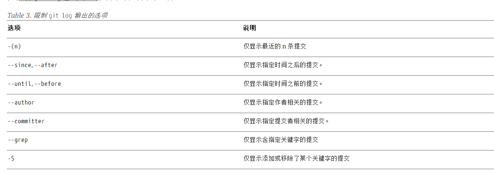
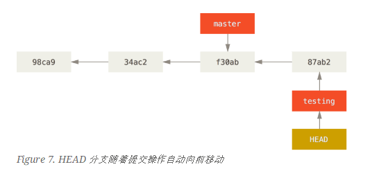

# git pro 
## 起步
### 关于版本控制
### Git简史
### Git基础
### 命令行
### 安装Git
### 初次运行Git前配置
## Git 基础
### 获取Git仓库
- 如何将目录初始化为git仓库？ git init
- 如何添加要提交的文件？ git add 文件名
- 如何提交更改？ git commit 文件名 -m 提交信息
- 如何克隆现有的git仓库？ git clone url
- 如何定义克隆仓库在本地的名称？ git clone url newName
- git有哪些数据传输协议？https SSH git
### 记录每次更新到仓库
- git 操作的生命周期是什么样的？

- 如何查看文件的状态？ git status。
- 刚创建的文件处于什么状态？ 刚刚创建的文件状态是untrack
- 如何将文件加入跟踪列表？ git add 文件名
- 使用add添加文件之后文件处于什么状态？ 添加之后处于等待提交状态。
- 修改之后，如何提交？ 修改之后处于待提交状态，同样使用git add 将其提交变成待提交状态。
- 如果我们修改了一个被跟踪的文件，文件会处于什么状态？ 这个时候文件会变成有两个状态，在使用git add 之前的修改已经被保存 在git add 之后的修改未被保存，所以运行了 git add 之后又作了修订的文件，需要重新运行 git add 把最新版本重新暂存起来。
- 如何使得你的git 状态变得简单？ git status -s
- 如何添加忽略文件？ 将不需要提交的文件名称模式添加到.gitignore 文件
    1. 所有空行或者以 ＃ 开头的行都会被 Git 忽略。
    2. 可以使用标准的 glob 模式匹配。
    3. 匹配模式可以以（/）开头防止递归。
    4. 匹配模式可以以（/）结尾指定目录。
    5. 要忽略指定模式以外的文件或目录，可以在模式前加上惊叹号（!）取反。
- gitignore 模板文件[仓库推荐](https://github.com/github/gitignore) 这个仓库提供了常用的gitignore 模板。
- 如何查看已经暂存和当前的文件之间的修改？ git diff
- 如何查看已经提交到暂存区的准备提交的内容的改变？ git diff --staged(--cache)
- 如何提交更新？ 提交前先使用git status 看下是不是都已经暂存起来了，然后使用git commit 进行提交。
- 如何设置默认的输入提交信息的编辑器？ git config --global core.edit 编辑器名称 一般可以使用vim 
 - 如何直接在命令行制定提交信息？ git commit -m "message"
 - 如何跳过暂存区直接提交？ 使用 git commit -a 可以把所有跟踪的文件都暂存起来，然后提交,从而跳过git add 
 - 如何删除文件？ 在git 中移除某个文件，就必须从已跟踪的文件清单中移除（准确的说是从暂存区中移除）
 - 如果仅仅想从缓冲区删除文件，但是想要在磁盘中保留，如何处理？ 使用 git rm --cached 文件名 文件名可以使用glob 模式（简化的正则表达式）
 - 如何给文件改名？ `git mv file_from file_to` 这个命令相当于运行了三条命令 ` mv file_from file_to ; git rm file_from ; git add file_to  `
 ### 查看提交历史
 - 如何查看提交历史？ `git log` 
 - git log 命令输出的格式是什么样的？

示例说明： 第一行显示提交的hash 值
第二行显示提交作者和邮箱
第三行显示 提交信息
提交历史显示顺序是从近到远的

- 如何查看具体的差异？ 可以使用 `-p` 选项在加上`-2`选项可以显示最近 2次的提交 

详情说明:除了显示上面四条消息之外还会把差异显示出来与使用git diff 命令相似
- 如何查看log 的简略信息？ `git log --stat`
选项在每次提交的下面列出所有被修改过的文件、有多少文件被修改了以及被修改过的文件的哪些行被移除或是添加了。 在每次提交的最后还有一个总结。
- 如何指定默认的提交历史的显示方式？ 使用`--pretty`选项，现在指定单行模式`git log --pretty=oneline`

- 如何指定自定义模式？ 使用 `git log --pretty=format '%h - %an, %ar : %s'` 格式参数说明：

- 有没有更形象的显示提交记录的形式？ 可以使用`git log --pretty=format:"%h %s" --graph` 

git log 选项列表

- 如何限制输出长度？ `git log --since=2.weeks`其中的时间显示 可以是具体的某一天，也可以是相对多久以前
- 如何筛选添加或删除某个字符串的提交？ `git log -Sfunction_name`
限制gitlog 输出的选项


### 撤销操作
- 如果我们提交完了才发现几个文件没有添加，或者提交信息写错了。此时运行带有`--amend`选项的`git commit --amend` 这是一次重新提交。
- 如果提交的和上一次没有什么改变会怎么样？ 那么只会改变提交信息快照还是快照。
- 如果提交之后改变了，那么会怎么样？ 
```
git commit -m 'initial commit'
git add forgotten_file
git commit --amdend
```
这个三个命令尽管是在commit 之后运行了一次add 但是最终你自会有一次提交--第二次的提交将会代替第一次提交的结果。
- 如何取消暂存的文件？例子：你已经修改了两个文件并且想要将他们作为两次独立的修改提交，但是意外地输入了`git add *`暂存了它们两个，如何取消暂存中的一个？
`git reset HEAD file`,文件已经是修改未暂存的状态了。
    - 提示，不加选项的git reset 并不危险，他只会修改暂存区，不会修改工作空间。
- 如何撤销对文件的修改？ 使用`git checkout -- filename`
    - `git checkout -- [file]`是一个危险的命令，你对文件做的任何修改都会消失，除非你真的不需要这个文件了，否则不要使用这个命令。
    - 如果你仍然想要保留对这个文件做出的修改，但是现在仍然需要撤销，那就切一个分支保留当前的修改，然后在主分支回退。
    - git中任何**已提交**的东西几乎总是可以恢复的。甚至那些被删除的分支中的提交或使用 --amend 选项也可以恢复。然而，任何未提交的东西丢失后很可能再也找不到了。
### 远程仓库的使用
- 查看远程仓库 `git remote`,如果你克隆了远程仓库，那么至少能看到origin--这是git给你客人的仓库服务器的默认名字
    - `git remote -v` 会显示需要读写远程仓库使用的Git保存的简写以及对应的URL，如果你的仓库不知一个，那么就会列出所有的仓库。
- 添加远程仓库
- 从远程仓库中抓取与拉取
    - 抓取和拉取有什么区别？ `git fetch [remote-name]` 这个命令会访问远程仓库，从中拉取所有你还没有的数据。执行完成之后，你将会拥有那个远程仓库的所有分支的引用，可以随时合并和查看。
    - clone 默认简写？ 如果使用clone 命令克隆一个仓库，命令会自动将其添加为远程仓库并默认以"origin"为简写。所以git fetch origin 会抓取克隆后新推送的所有工作。必须要注意，fetch 只会将数据拉取到你的本地仓库-- 并不会自动合并或修改你当前的工作目录。准备好时你必须手动将其合并入你的工作。
    如果有一个分支设置为跟踪一个远程分支，可以使用git pull 命令来自动抓取然后合并远程分支到当前目录
- 推送到远程分支
    - 当你想要分享你的项目时，必须要将其推送到上游，这个命令很简单`git push [remote-name] [branch-name]`。当你想要将master分支推送到origin服务器时（clone 时会帮你自动设置这两个名字），那么运行这个名利可以将你做的推送到服务器。
    `git push origin master`
        - 当你有clone 服务器的写入权限，并且之前没有人推送过时，这条命令才会生效。当你或者其他人在同一时间克隆，他们先推送到上游然后你再推送，你的推送将会被拒绝。你必须先拉取别人的修改并将修改合并到你的代码中才能推送你的。
- 查看远程仓库
    使用`git remote show [remote-name]` 命令。
- 远程仓库的移除和重命名
    `git remote rename [old-name] [new-name]`

### 打标签
- 列出标签 `git tag`
- 添加标签过滤 `git tag -l 'v1.85*'`
- 创建标签
    - 标签的分类 
    1. 轻量级标签
    一个轻量标签很像一个不会改变的分支 - 它只是一个特定提交的引用。 
    2. 附注标签
    附注标签是存储在 Git 数据库中的一个完整对象。 它们是可以被校验的；其中包含打标签者的名字、电子邮件地址、日期时间；还有一个标签信息；并且可以使用 GNU Privacy Guard （GPG）签名与验证。 通常建议创建附注标签，这样你可以拥有以上所有信息；
- 创建附注标签 `git tag -a v1.4 -m 'my version 1.4'`
- 使用 `git show v1.4`输出显示了打标签者的信息、打标签的日期时间、附注信息，然后显示具体的提交信息。
- 创建轻量级标签 `git tag v1.4-lw`
使用`git show v1.4-lw`命令只会显示出提交信息。
- 后期打标签
    可以对过去的提交打标签，要对过去的提交打标签需要在命令末尾指定提交的校验和`git tag -a v1.2 9fceb02`
- 共享标签
    默认情况下`git push`命令不会传送标签到远程仓库的服务其上。在创建完标签后必须要显式推送标签到服务器上
    - 推送某个标签`git push origin v1.5`
    - 推送所有的标签 `git push origin --tags`
- 检出标签
    - 将标签检出为分支 `git checkout -b version2 v2.0.0`
### Git 别名
- 如何更简单的使用git？ 如果不想要每次输入完整的git 命令，可以通过git config 文件来轻松地为每一个命令设置一个别名
    ```
    git config --global alias.co checkout
    git config --global alias.br branch
    git config --global alias.ci commit
    git config --global alias.st status
    ```
- 给取消暂存起别名 `git config --global alias.unstage 'reset HEAD --'`
- 添加一个`last` 命令 `git config --global alias.last 'log -1 HEAD'` 这个命令可以看到最后一次提交
## Git 分支
- 其他版本控制系统的分支过程是什么样的？ 在很多版本控制系统中，创建分支是一个低效的过程-- 常常需要创建一个源代码目录的副本，这回消耗很多时间。
### 分支简介
- git 的提交对象是什么样的？ git 的提交对象会包含一个指向暂存内容快照的指针。这个提交对象包含了作者的姓名邮箱、提交时输入的信息以及指向他的父对象的指针。第一次提交的代码没有父对象，普通提交操作产生的提交对象有一个父对象，由多个分支何必产生的对象有多个父对象。
- git commit 的提交细节是什么样的？ 执行git commit 提交操作的时候git会想计算每一个子目录的校验和，然后再git仓库中这些校验和被保存为树对象。随后，Git便会创建一个提交对象，它除了包含上面提到的信息外，还包含指向这个树对象的指针。如此依赖，git 就可以再需要的时候重现这次保存的快照。 

第二次提交这些对象会包含一个指向上一次提交（父对象）的指针


- git分支是什么？ git的分支，本质上仅仅是指向提交对象的可变指针。git的默认分支名称叫做master。再多次提交操作之后，你其实已经有一个指向最后那个提交对象的master分支。它每次提交操作自动向前移动。

- 如何创建新分支？ `git branch branchName`

- 如何知道当前分支是哪一个？ git有一个名为HEAD 的特殊指针。
- 如何查看当前分支是哪一个？ `git log --oneline --decorate`
- 分支如何切换？ `git checkout [branch-name]` 
- 切换分支后并在分支上做了修改后提交会发生什么？  如图所示testing 分支向前移动了但是master分支却没有，仍然指向运行git checkout 时所指的对象。
- 从修改并提交更改的分支切回主分支会发生什么?   执行`git checkout master`这条命令的时候会发生两件事情 1. 使得HEAD指回master分支，二是将工作目录恢复成master分支所指的快照内容，项目将始于一个较旧的版本。
- 提交历史的分叉 
- 使用`git log`查看分叉历史。运行`git log --oneline --decorate --graph --all`它会输出提交历史、各个分支的指向以及项目的分叉情况。
- git 的分支实质时什么？ git分支实质上仅是包含所指对象校验和（长度为40的SHA-1值字符串）文件,所以创建和销毁都很高效。一个新分支就相当于往一个文件中写入41个字符（40 字符校验和以及1个换行符）
### 分支的新建与合并
- 实例分析 在工作中会遇到如下情况
    1. 开发某个网站
    2. 为实现某个新需求，创建一个分支
    3. 在这个分支上开展工作
 
  在此时修复一个严重的问题，按照如下方式处理：
    1. 切换到线上分支
    2. 为这个紧急任务新建一个分支，并在其中修复它
    3. 在测试通过之后，切换会线上分支，然后合并修补分支，最后将改动推送到线上分支
    4. 切换回你最初工作的分支上，继续工作。
- 新建分支 在一个已经有部分提交历史的系统中工作。

使用`git checkout -b iss53`创建一个分支，此命令是`git branch iss53 git checkout iss53`两条命令的简写。在问题分支上工作。现在遇到一个紧急问题，有了git的帮忙，你不必把这个紧急问题和当前的工作目录混合在一起。不过在这之前需要先提交你的更改，不然会阻止你切换到主分支。
### 分支管理
### 分支开发工作流
### 远程分支
### 变基
## 服务器上的Git
### 协议
### 在服务器上搭建Git
### 生成SSH公钥
### 配置服务器
### Git守护进程
### Smart HTTP
### GitWeb
### GitLab
### 第三方托管选择
## 分布式Git
### 分布式工作流程
### 向一个项目贡献
### 维护项目
## GitHub
### 账户的创建和配置
### 对项目做出贡献
### 维护项目
### 管理组织
### 脚本GitHub
## Git工具
### 选择修订版本
### 交互式暂存
### 储藏与清理
### 签署工作
### 搜索
### 重写历史
### 重置揭秘
### 高级合并
### Rerere
### 使用Git调试
### 子模块
### 打包
### 替换
### 凭证存储
## 自定义Git
### 配置Git
### Git 属性
### Git钩子
### 使用强制策略的一个例子
## Git 与其他系统
### 作为客户端的Git
### 迁移Git
## Git 内部原理
### 底层命令和高层命令
### Git对象
### Git引用
### 包文件
### 引用规格
### 传输协议
### 维护与数据恢复
### 环境变量
## 其他环境中的Git
### 图形界面
### Visual Studio 中的Git
### Eclipse 中的Git
### Bash 中的Git
### Zsh 中的Git
### PowerShell 中的Git
## 将Git嵌入你的应用
### 命令行Git方式
### LibGit
### JGit
## Git 命令
### 设置与配置
### 获取与创建项目
### 快照基础
### 分支与合并
### 项目分享与更新
### 检查和比较
### 调试
### 补丁
### 邮件
### 外部系统
### 管理
### 底层命令